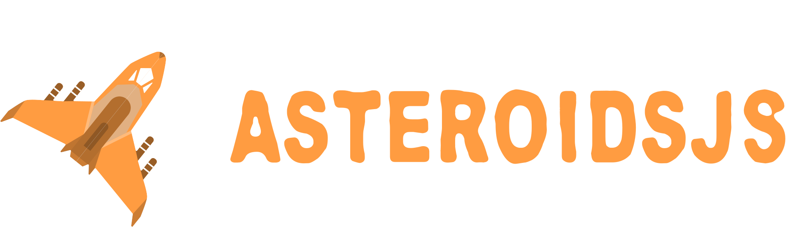
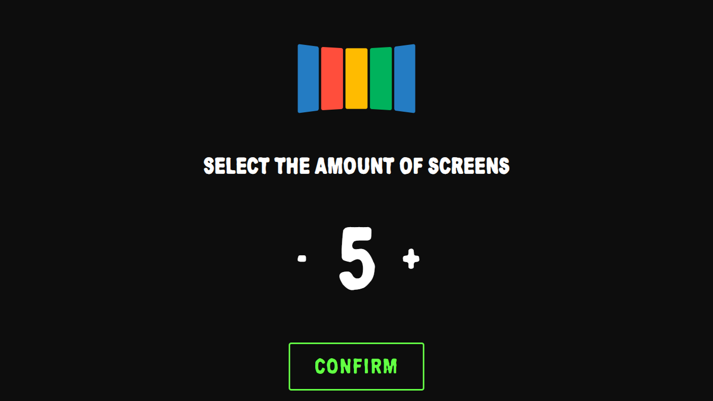
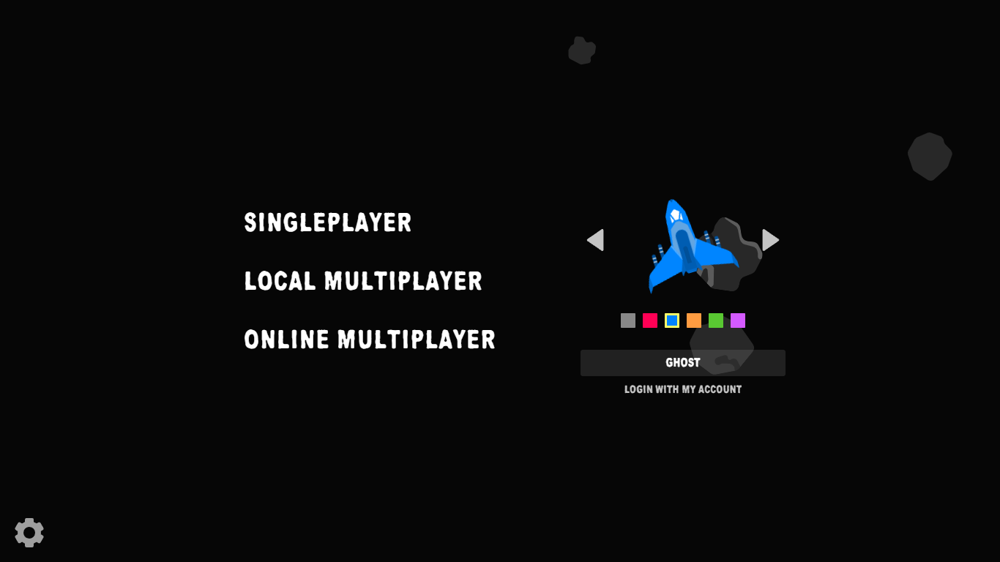
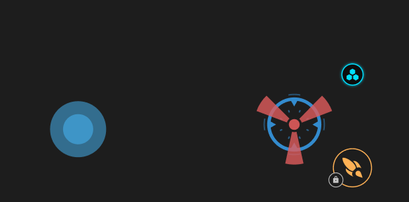
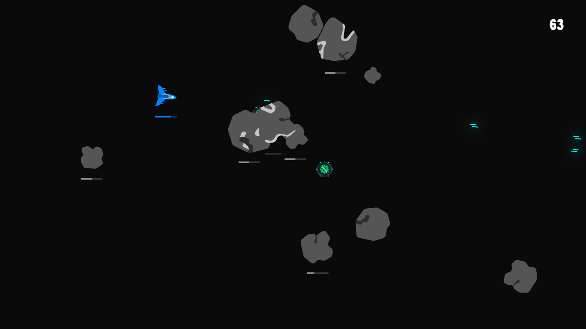
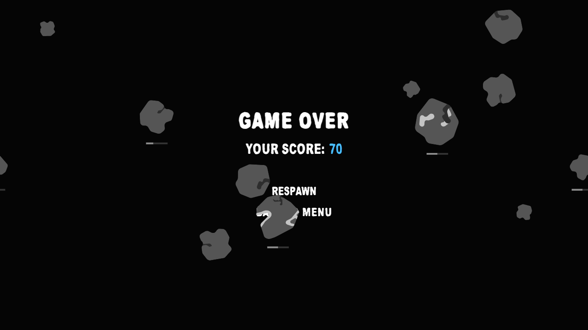

<div align="center" style="margin-bottom: 40px">
  
</div>

## About

<p>
The project consists of a multiplayer game that looks like the old Asteroids with the Diep.io mechanics. Players will control their spaceships in a limited battlefield (the space) with their keyboard or virtual joystick (cellphone), in order to fight each other for the highest score, resulting in a thirsty competition, that is exactly what most players like. To distinguish one spaceship from another, they’ll have different colors and, perhaps, different shapes, which will be selected by the user. Whereas the map is the space, it can’t be just a massive black field, it must have space elements, such as asteroids, stars, planets, etc.

At first, the game should have the primordial elements commented above, so it can be played and enjoyed. As long as the project development, additional features can be added to it, from small details like particles after destroying a player or an asteroid, to complex events that occur during the match, such as a star that may explode or a blackhole passing through the field that attracts everything that is on its way. Another extra feature that could be added is the power up, taken from temporary bonuses that would be acquired from a powered asteroid.

Every time a player gets destroyed, he will be given the choice to return to the main menu or respawn at a random place, with a temporary spawn protection and less points. This will give him the chance of getting his score again and raise in the ranking.

More about the game will be explained ahead.

</p>

<hr>

## Summary

- [About](#about)
- [Getting Started](#getting-started)
- [Running and building](#running-and-building)
- [Testing](#testing)
- [Playing the game](#playing-the-game)
  - [Connecting Screens](#connecting-screens)
  - [Main Menu](#main-menu)
    - [Game Modes](#game-modes)
    - [Customization](#customization)
    - [Authentication](#authentication-warning)
    - [Settings](#settings-warning)
    - [Virtual Controller & Joystick](#virtual-controller--joystick)
- [Gameplay](#gameplay)
  - [Singleplayer](#singleplayer)
  - [Local Multiplayer](#local-multiplayer)
  - [Online Multiplayer](#online-multiplayer-warning)
- [Technologies](#technologies)
- [License](#license)

<hr>

## Getting Started

Be sure to have [Git](https://git-scm.com/) and [Node.js](https://nodejs.org/en/) installed.

> It is recommended to have the version 14 or higher of Node.js.

Clone the project using:

```bash
$ git clone 'https://github.com/AsteroidsJS-Official/web.vanilla.asteroidsjs.git'
```

For OAuth tokens, do:

```bash
$ git clone 'https://<token>@github.com/AsteroidsJS-Official/web.vanilla.asteroidsjs.git'
```

Then install all of its dependencies:

```bash
$ npm install
```

For VSCode developers, it's also highly recommended to install some extensions:

- ESLint
- Prettier - Code formatter
- Husky (For commit linting)

<hr>

## Running and building

To run the application, simply run:

```bash
$ npm start
```

If you want to build without running, run:

```bash
$ npm run build
```

By default, all generated builds are for development. For production builds, add a `:prod` in front of the `start` or `build`.

```bash
$ npm run start:prod
```

```bash
$ npm run build:prod
```

The game will be listening in the 8080 port. Access `localhost:8080` to play it.

<hr>

## Testing

Tests are available and were implemented using the Jest library.

Running the tests is really simple:

```bash
$ jest
```

```bash
$ npm test
```

It also possible to generate a report using the following command:

```bash
$ jest --collect-coverage
```

<hr>

## Playing the game

There are some different ways and modes to play the game.

Developed to fit [Liquid Galaxy](https://liquidgalaxy.org/) project model, the game may be executed in many screens/computers.

### Connecting screens

In the first scene, the game will ask for the screen amount to compute the canvas width. The minimum is 1 and the maximum is 9 and only odd amounts are available.



From now on, the main screen will be called **Master** and the others **Slaves**.

> Note that the **Slaves** screens does not need to be running an instance of the game, it will connect directly to the **Master** using the local network.

When the confirm button is clicked, the **Master** will wait for **Slave** connections. The **Slave** to be connected will be blinking until the connection is established.

In example, a screen layout for a total of 5 screens is: `[4, 5, 1, 2, 3]`

The connection is made from the **Master** (middle screen/screen 1) to the right. When it reaches the last screen (3) of the layout, it will "jump" to the other side (screen 4) and keep connection until the last screen (5) is connected.

When a screen is connected, its URL will update from `...:8080` to `...:8080/screen/:screenNumber`.

> _The port **8080** may suffer changes depending on the developer needs._

### Main menu

After confirming the amount of screens that the game will be displayed on, the main menu scene will be loaded.



In the menu, many features may be seen at first, but their complexity of use is pretty simple.

> Note that some features are not fully implemented, such as the authentication logic, the spaceship skin/type picker and the settings page/modal.

#### Game Modes

There are 3 modes in the game:

- Singleplayer: play alone and increase your score destroying asteroids, using the keyboard or cellphone.

- Local Multiplayer: play against other players in the same machine, using the cellphone.

- :warning: Online Multiplayer (not implemented): play against other players in the selected server, using the keyboard or cellphone.

> _The Online Multiplayer is going to be developed soon._

#### Customization

The player spaceship and nickname may be customized, but have its limitations.

- Spaceship: color and type :warning: are customizable, but only with options set by the developers.

- Nickname: almost any character are accepted, but the nickname length may be from 1 (minimum) to 20 (maximum).

> _The spaceship type is going to be developed after the Online Multiplayer game mode._

#### Authentication :warning:

The user may login or sign up to keep all of its data in the database, making possible to have score records and achievements.

> _The authentication logic is not implemented due to its dependency on the API, in which does not have the authentication ready._

#### Settings :warning:

It will be needed in order to configure some features in the game, such as music and effects volume.

#### Virtual Controller & Joystick

The virtual controller is a mobile version of the game, it may be accessed using the same URL without any paths.




It is used to control the main menu in **Master** screen.

The joystick is developed with [Nipple.js](https://yoannmoi.net/nipplejs/) and is used to give the player another spaceship controller option, similar to the console ones. It is also useful to join players to a [Local Multiplayer](#local-multiplayer) match.

<hr>

## Gameplay

The gameplay consists in a space war, with tons of asteroids passing by and players fighting each other endlessly. Therefore, the game main game modes are [Local and Online Multiplayer](#local-multiplayer), making the [Singleplayer](#singleplayer) a mode to practice your skills and test new spaceships and game features.

The idea of having multiple spaceship types makes the game cooler and less cloying, increasing players options and competitivity.

### Singleplayer

In Singleplayer, the player must focus on destroying the most asteroids as possible without dying. In the meanwhile, powered asteroids will appear, offering power ups that may increase the player life time.



In this picture, a lot of the mode may be seen, such as the spaceship and its bullets, the asteroids, some power ups and the player score.

When the player dies, the game over screen is shown, giving the option to return to the main menu or respawn with no points.



> Asteroids may pass through the game over texts, given a really interesting look and immersion to the game.

### Local Multiplayer

The Local Multiplayer is a mode that supports unlimited players to join into a lobby created by the **Master** player. To be able to join the match, the player must connect to the game using its mobile device, in which the first player to connect will be the _**Master** player_, whom is responsible for creating the lobby.

When a player dies, its score decreases by 30% and a game over screen will appear in its mobile device, asking to respawn or return to the main menu.

In case the **Master** player returns to the main menu or disconnects, the lobby will close and all players will return to the main menu as well.

### Online Multiplayer :warning:

The Online Multiplayer offers some servers for players to join from any computer that has access to the internet. The players may play from their keyboard or mobile device.

> _The Online Multiplayer mode is not available yet. Its implementation is planned for the end of October to the beggining of November._

<hr>

## Structure

The project is slightly separated into 3 main folders (libs, server, src):

<details>
  <summary>libs/</summary>

- asteroidsjs/

  - src/
    - decorators/
    - interfaces/
    - math/
    - utils/
    - abstract-component.ts
    - abstract-entity.ts
    - abstract-scene.ts
    - abstract-service.ts
    - asteroids.factory.ts
    - constants.ts
  - index.ts
  - tsconfig.lib.json

</details>

<details>
  <summary>server/</summary>

- index.js
- server.js
</details>

<details>
  <summary>src/</summary>

- @types/
- assets/
  - audios/
  - fonts/
  - html/
  - scss/
  - svg/
  - ts/
    - objects/
      - some-object/
        - components/
        - entities/
        - enums/
        - interfaces/
    - scenes/
      - some-scene.scene.ts
    - shared/
      - components/
      - entities/
      - enums/
      - interfaces/
      - services/
    - ui/
      - some-ui-element/
        - entities/
        - enums/
        - interfaces/
    - utils/
- global.scss
- index.html
- index.ts
</details>

<hr>

## Technologies

- [Typescript](https://www.typescriptlang.org/)
- [Node.js](https://nodejs.org/)
- [Socket.io](https://socket.io/)
- [Nipple.js](https://yoannmoi.net/nipplejs/)
- [RxJS](https://rxjs.dev/)
- [SASS](https://sass-lang.com/)
- [Webpack](https://webpack.js.org/)
- [Jest](https://jestjs.io/)

<hr>

## License

The AsteroidsJS project is licensed under the [MIT license](https://opensource.org/licenses/MIT).
